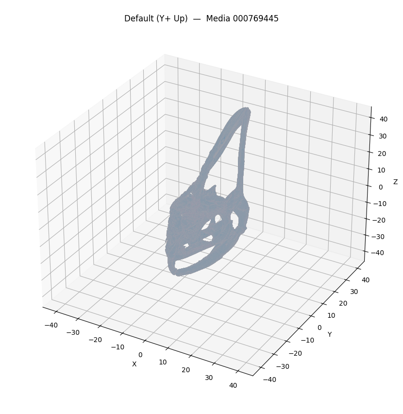
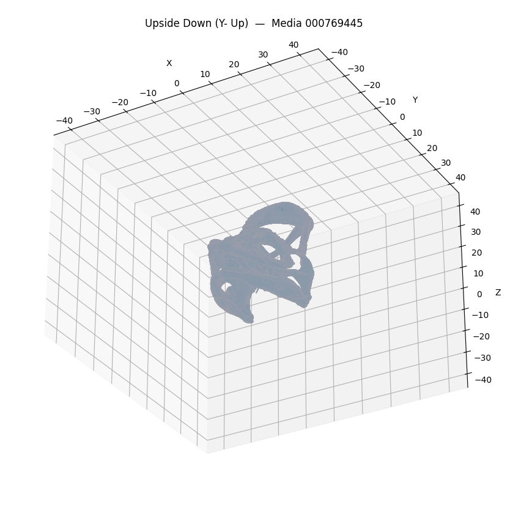
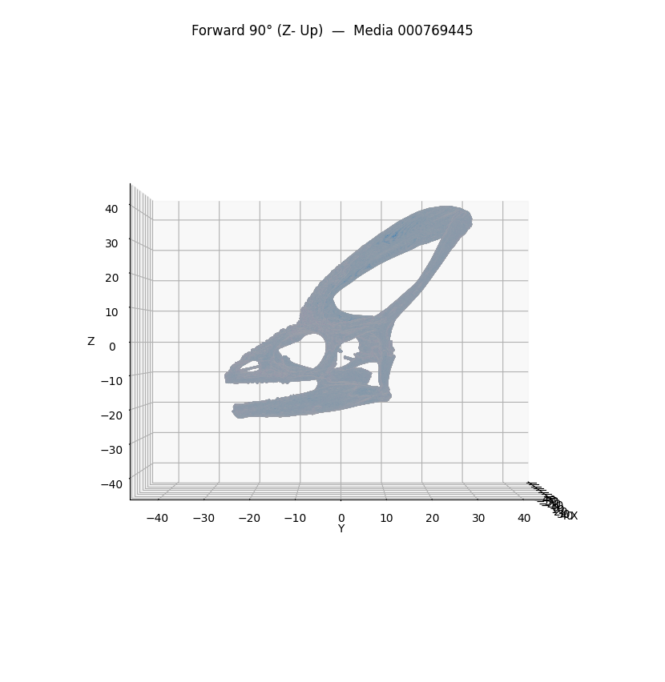
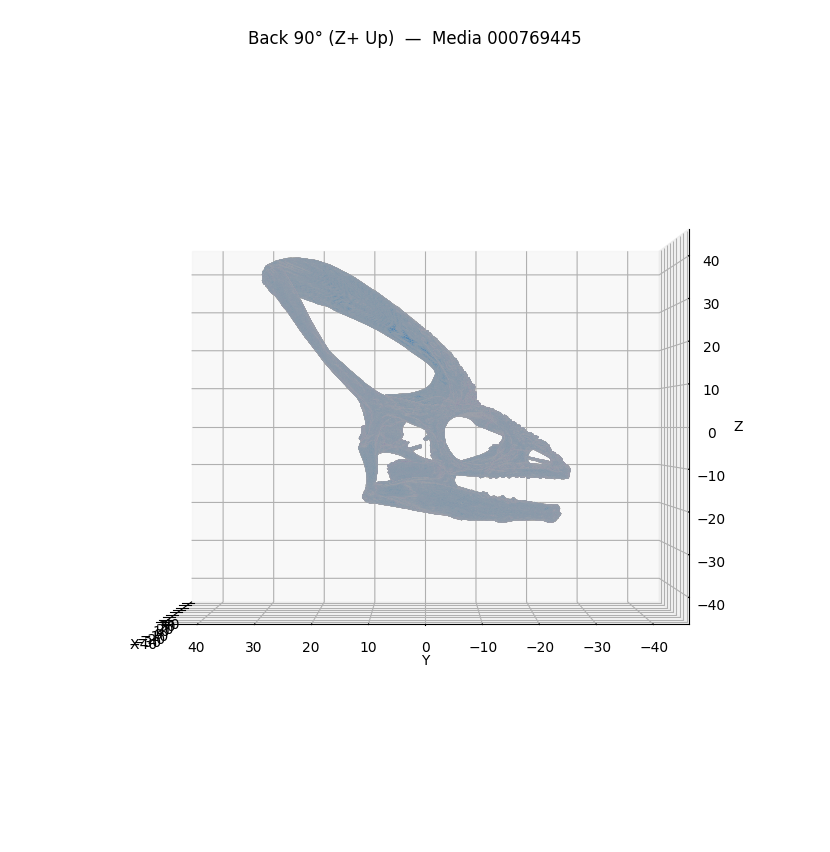

# Mesh Analysis — Media 000769445

**Source file**: `/tmp/mesh_extract_h94n4im8/morphosource_media-id-000769445_download-24f73f1b/Media 000769445 - Skull/veiled-chameleon-skull-anatomy-000769445.ply`

## Mesh Metrics

```json
{
  "path": "/tmp/mesh_extract_h94n4im8/morphosource_media-id-000769445_download-24f73f1b/Media 000769445 - Skull/veiled-chameleon-skull-anatomy-000769445.ply",
  "vertices": 2170335,
  "faces": 4366930,
  "is_watertight": false,
  "surface_area": 14353.229753112188,
  "volume": 2947.8585323551065,
  "bounding_box_extents": [
    26.829049110412598,
    57.62051773071289,
    65.91527462005615
  ],
  "centroid": [
    -0.2983348399376824,
    4.824127215884141,
    9.939306350770373
  ]
}
```

## Screenshots






## GPT-4 Vision Analysis

Based on the provided 3D mesh data and the various orientations of the specimen, here is a detailed analysis:

### 1. Structural Characteristics and Overall Morphology
- **Vertices and Faces**: The mesh consists of 2,170,335 vertices and 4,366,930 faces, indicating a highly detailed model capable of capturing intricate details of the specimen's morphology.
- **Volume and Surface Area**: The volume of the specimen is approximately 2947.86 cubic units, with a surface area of around 14353.23 square units. This suggests a relatively complex structure, suitable for detailed analyses in morphology studies. 
- **Bounding Box Extents**: The dimensions of the bounding box are approximately 26.83 (X), 57.62 (Y), and 65.92 (Z), indicating an elongated structure, which is characteristic of skulls or elongated specimens. 

### 2. Surface Features and Notable Topology
- **Surface Features**: The non-watertight characteristic suggests the presence of holes or gaps in the mesh that could be a result of natural wear, manufacturing process, or imperfections in the scanning process.
- **Topology**: Potentially distinct cranial features, such as cresting, fenestration (openings or windows in the bone), and sutural lines, could be evident from the varying views. Depending on the features noted across the different angles, a complex topology may be present that corresponds to anatomical structures found in reptiles.

### 3. Potential Specimen Type
- Given the anatomical context provided by the name and structure, the specimen is likely a part of the skull belonging to a reptile, possibly a chameleon based on the filename. Its structural characteristics, along with the cranial features typically associated with reptiles, support this classification. 

### 4. Notable Features or Anomalies Across Views
- **Views Analysis**:
  - **Default (Y+ Up)**: Shows a profile view typically highlighting the elongated shape and any distinct cranial features.
  - **Upside Down (Y- Up)**: This view may emphasize ventral structures and reveal any damage or alterations not visible in the upright position.
  - **Forward 90° (Z- Up)**: Presents a view from the front, highlighting facial features that may indicate tooth structure or other relevant morphological aspects.
  - **Back 90° (Z+ Up)**: Provides a view from the rear, which could reveal the occipital region and any unique structural components of the skull.

Across all orientations, a detailed examination could reveal features like textural intricacies, potential fractures, or abnormal wear patterns, which could indicate the specimen's usage or history. 

### Conclusion
In summary, the 3D model presents a well-detailed specimen potentially representing a chameleon's skull, rich in morphological features suitable for further anatomical studies or paleontological analysis. The mesh's fidelity allows for in-depth examination of structural and surface characteristics that might not be visible in two-dimensional representations. Further study could involve comparative analyses with known specimens to validate the identification and explore evolutionary lineage implications.
