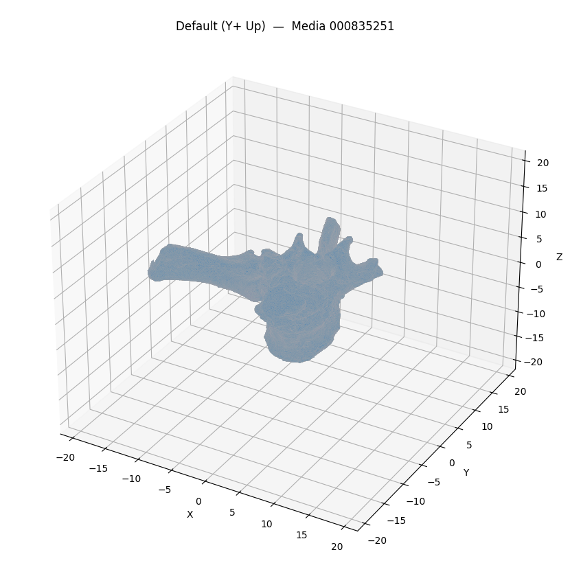
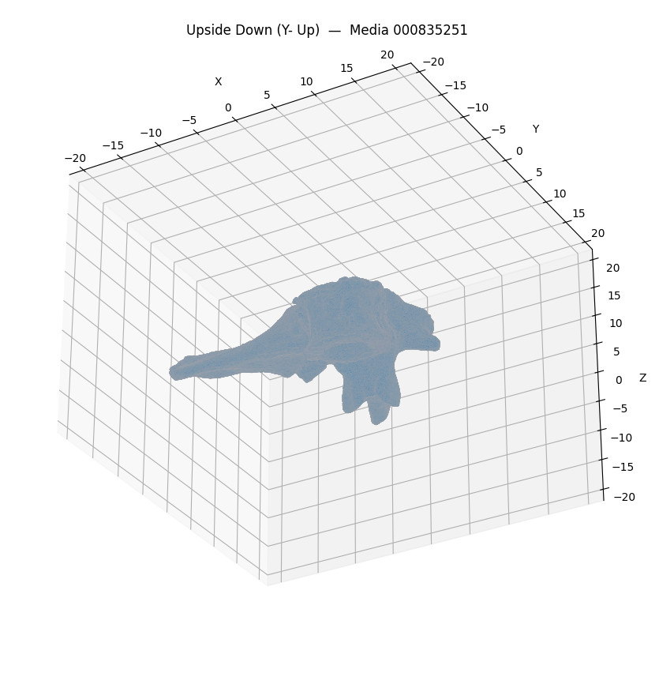
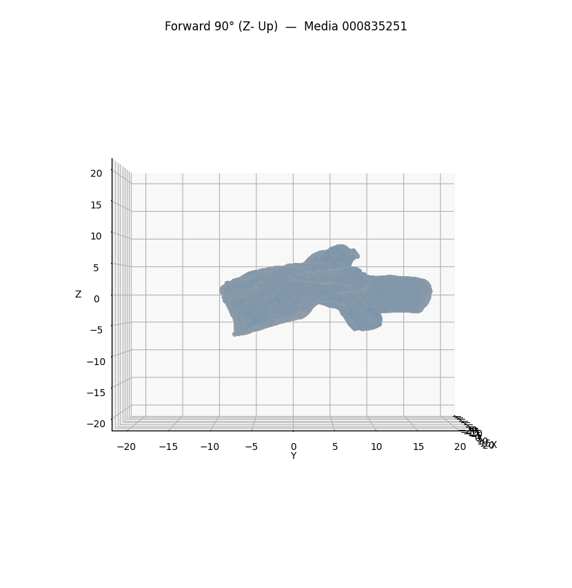
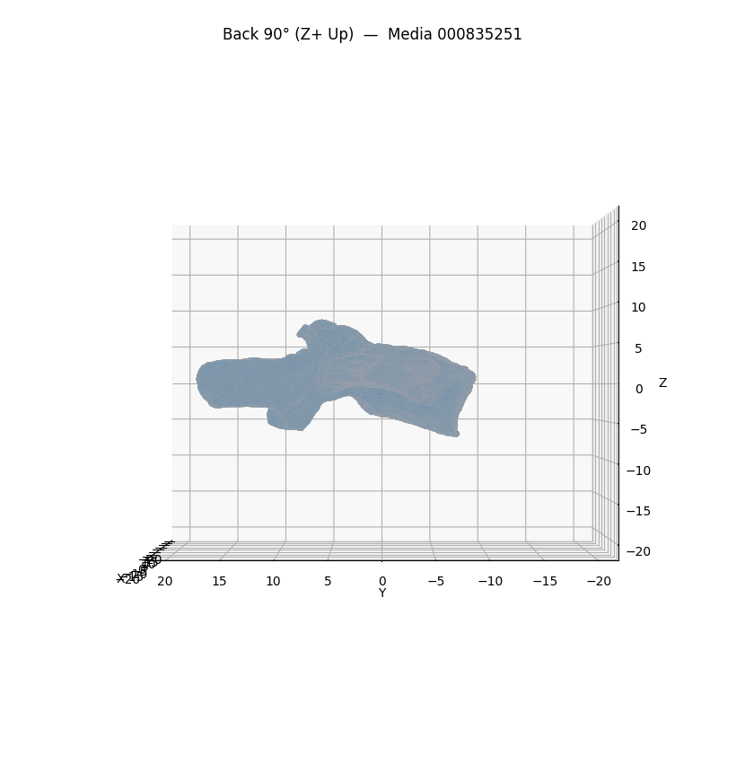

# Mesh Analysis — Media 000835251

**Source file**: `/tmp/mesh_extract_ycyzl3um/Procynosuchus_meshes-000835251/Procynosuchus_meshes/Reduced_Procyno_V12.ply`

## Mesh Metrics

```json
{
  "path": "/tmp/mesh_extract_ycyzl3um/Procynosuchus_meshes-000835251/Procynosuchus_meshes/Reduced_Procyno_V12.ply",
  "vertices": 497471,
  "faces": 1000000,
  "is_watertight": false,
  "surface_area": 4541.697200828243,
  "volume": 1192.437244673721,
  "bounding_box_extents": [
    29.118942260742188,
    27.394261598587036,
    15.539371490478516
  ],
  "centroid": [
    23.50345249468241,
    12.755899720388683,
    9.228231525498721
  ]
}
```

## Screenshots






## GPT-4 Vision Analysis

### Analysis of 3D Mesh Data for Specimen

1. **Structural Characteristics and Overall Morphology:**
   - The mesh consists of **497,471 vertices** and **1,000,000 faces**, indicating a high level of detail, despite the mesh not being watertight. This suggests it is a complex structure, likely representing an object with intricate shapes and surface features.
   - The **surface area** measures approximately **4541.70 square units**, and the **volume** is about **1192.44 cubic units**, indicating a moderately sized specimen. The dimensions captured in the **bounding box** (extents: 29.12 x 27.39 x 15.54) imply a somewhat flattened or irregular shape, rather than a symmetrical one.

2. **Surface Features and Notable Topology:**
   - The mesh exhibits various surface features that could include textures, ridges, or depressions—details important for identifying the specimen.
   - The lack of watertightness may indicate the presence of holes or gaps in the mesh, which may affect the interpretation of surface topology.
   - The orientation views suggest varied profiles that could exhibit different prominent features—like growth patterns or wear, indicating environmental or usage factors.

3. **Potential Specimen Type:**
   - Given the structure and characteristics, the specimen could likely be a **fossil** or **bone**, particularly considering the high vertex and face count indicative of a complex natural formation. The irregular shape and the context of the specimen from MorphoSource suggest it falls into these categories.
   - If it is indeed a fossil, it may provide insights into the morphology of extinct species, possibly prompting comparisons with known specimens for identification.

4. **Notable Features or Anomalies Visible Across Views:**
   - The different angles may reveal features such as:
     - **Asymmetry in shape**: Significant deviations on either side could depict natural asymmetrical growth or post-mortem distortion.
     - **Different visibility of ridges or wear patterns**: Specific orientations might highlight unique surface features not apparent from a single view.
     - **Changes in surface texture**: Certain orientations may show more detailed texturing that could correspond to anatomical features or preservation states.
   - Observing features such as cracks, pits, or surface abrasions across the four orientations would be essential for a more thorough analysis.

### Conclusion
The specimen represented by the 3D mesh data appears to be a complex fossil or bone, with notable features that warrant further investigation. Analyzing various perspectives can provide crucial insight into its morphology and historical background, ultimately aiding in better identification and understanding its context within paleontological research.
