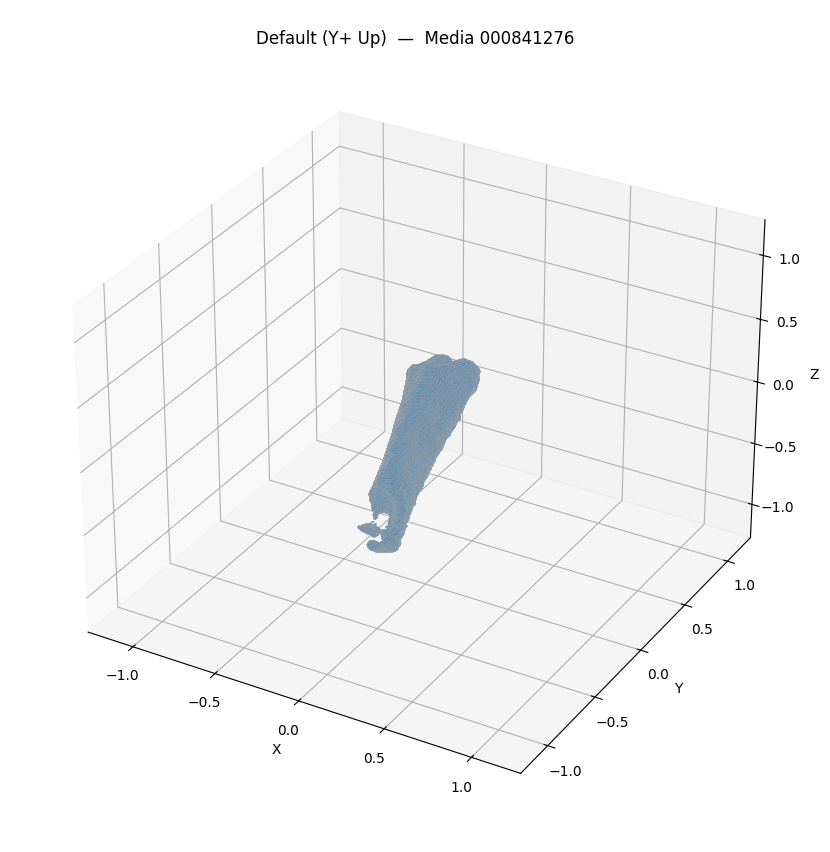
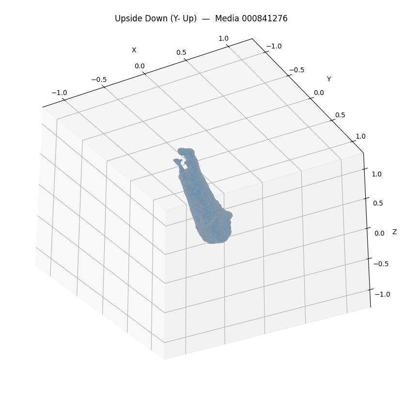
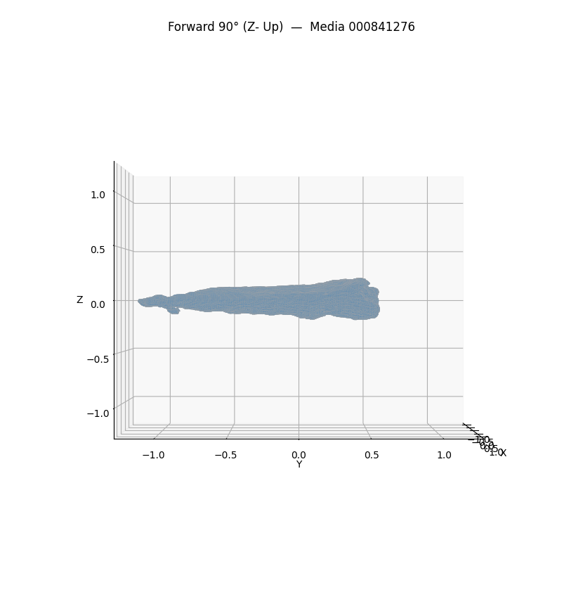
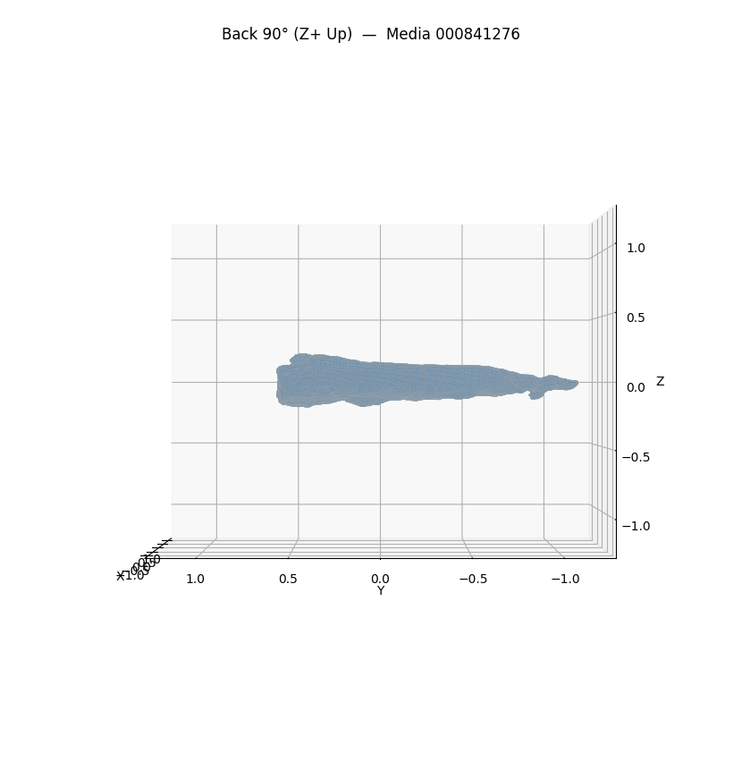

# Mesh Analysis — Media 000841276

**Source file**: `/tmp/mesh_extract_ntmvw23v/morphosource_media-id-000841276_download-c64f5249/Media 000841276 - Digit V, Phalanx 2 (Pes), Reoriented/Allaeochelys_crassesculpta_SMF_Me-611_L_Digit_V_phalanx_2_Reoriented-000841276.ply`

## Mesh Metrics

```json
{
  "path": "/tmp/mesh_extract_ntmvw23v/morphosource_media-id-000841276_download-c64f5249/Media 000841276 - Digit V, Phalanx 2 (Pes), Reoriented/Allaeochelys_crassesculpta_SMF_Me-611_L_Digit_V_phalanx_2_Reoriented-000841276.ply",
  "vertices": 28674,
  "faces": 57168,
  "is_watertight": true,
  "surface_area": 2.3645744490014575,
  "volume": 0.08772431701265254,
  "bounding_box_extents": [
    0.8157979846000671,
    1.7574052810668945,
    0.4102763682603836
  ],
  "centroid": [
    -0.15229260369594474,
    -4.507902042517044,
    -0.25613885373272127
  ]
}
```

## Screenshots






## GPT-4 Vision Analysis

Based on the provided 3D mesh data and the visualizations, here's a detailed analysis of the specimen:

### 1. Structural Characteristics and Overall Morphology
- **Vertices and Faces**: The mesh comprises 28,674 vertices and 57,168 faces, suggesting a detailed representation of the specimen. The relatively high vertex count indicates a smooth surface, which is important for identifying features and characteristics of the specimen.
- **Overall Shape**: The overall morphology appears elongated and possibly cylindrical, with a tapering end, indicative of a phalanx or digit structure.
- **Bounding Box Extents**: The bounding box measurements (0.82 x 1.76 x 0.41) suggest an asymmetrical shape, reinforcing the interpretation that this specimen is a digit, possibly from a limb.

### 2. Surface Features and Notable Topology
- **Surface Area and Volume**: The surface area is approximately 2.36 m², and the volume is around 0.0877 m³. These metrics indicate a relatively low volume compared to its surface area, typical of elongated structures like phalanges.
- **Topology**: The surface topology appears to be smooth with slight curvature, which may represent the natural curvature of bone or a polished surface of an artifact. The lack of apparent voids suggests it is well-formed and potentially watertight, as indicated by the "is_watertight" property.

### 3. Potential Specimen Type
- **Identification**: Given the measurements and the structural characteristics, the specimen is likely a vertebrate digit (phalanx) from the pedal region (derived from the term "pes"). The morphology resembles that of some reptiles or birds, potentially indicating that it belongs to a historical or prehistoric species.
- **Material**: The smoothness of the surface could suggest a fossilized bone or a well-preserved specimen. If it’s an artifact, it might have been crafted from bone or a similar material.

### 4. Notable Features or Anomalies Across Views
- **Orientation Differences**: Different orientations provide varying perspectives of the specimen, with the Forward 90° (Z-Up) and Back 90° (Z+ Up) views showing a more profile aspect, allowing for better examination of length and width.
- **Symmetry**: The mesh appears relatively symmetrical, suggesting that the specimen is not exhibiting significant deformities or anomalies typical in fossilized remains. However, minor anomalies may exist which are not explicitly visible in the 3D renderings without detailed close-ups.
- **Curvature**: The gentle curves and tapering towards the ends can indicate articulation points or both functional adaptations in the context of locomotion.

### Summary
This analysis provides insights into the structural, surface, and morphological aspects of the specimen. It shows strong indications of being a phalanx from a reptile or bird, characterized by its elongated shape and structural integrity. The mesh details would be invaluable for further research on its classification and historical significance.
